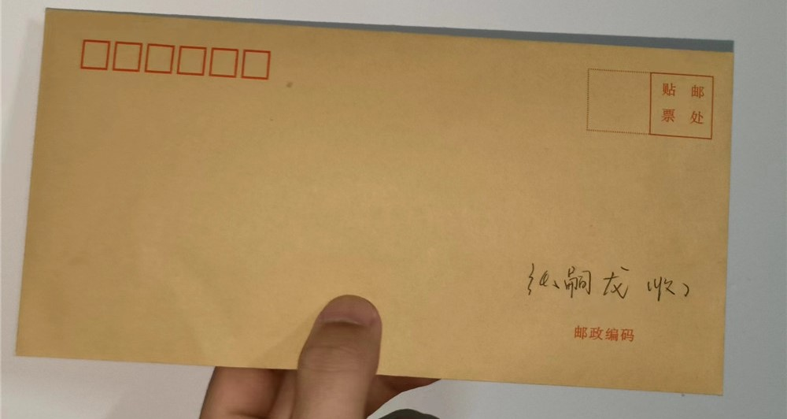
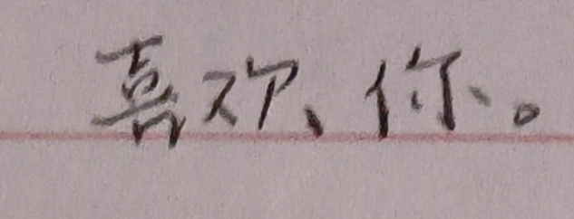
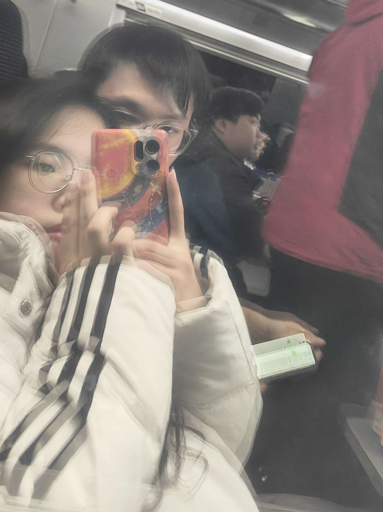
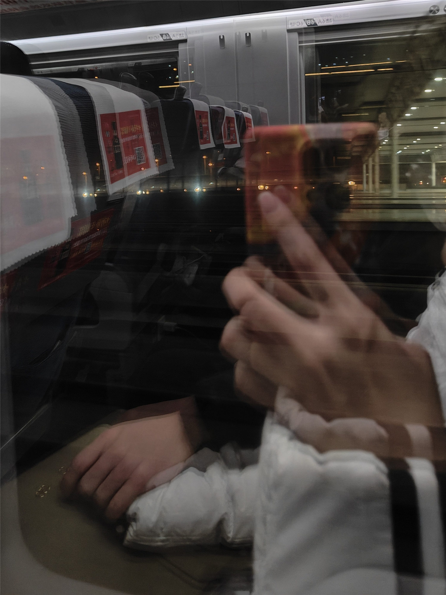
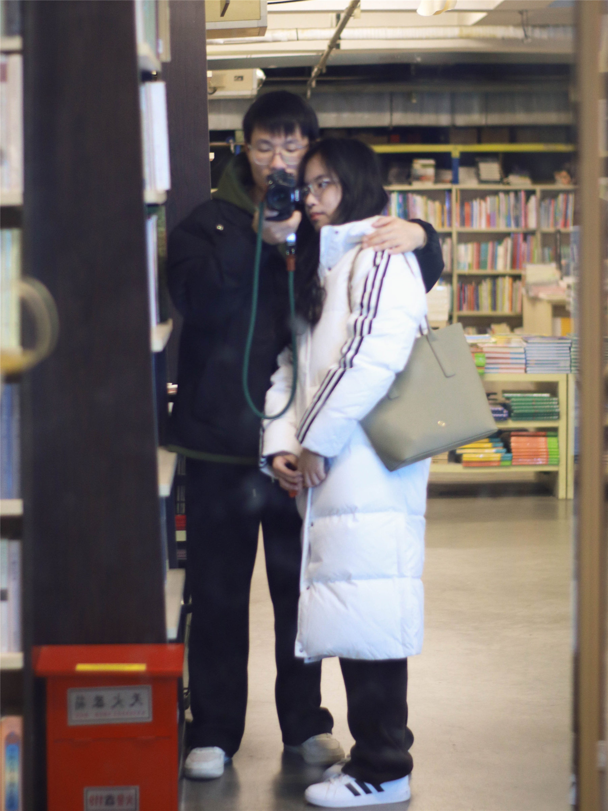

# 思佳与龙龙的大事记 2024年

### 1月2日

今天你元旦回学校了 送了你2024年的第一束花也是送你的第二束 晚上一起在学校吃了那家食堂的鸡蛋羹 向我炫耀了我们一起买的那个发绳 虽然我表面波澜不惊 但是内心感受到了一种也被重视的感觉 你问我怎么了 其实我是好想你 太想你了 太在乎你了 我也会患得患失 今天收到了你的巴莉甜甜投喂还有你的信 这是我第一次被人这么重视并且有回应 我的点点滴滴和小情绪也被你看在眼里 看了信中你的话 我也如同豁然开朗一般 张思佳你整这么深情是想要了我的命吗 我也想说：你值得。 喜欢你 愿我们一年又一年

### 1月14日~17日 南京

终于开启了我们的南京之旅，如果我还是一个人的话，南京可能在我的大学时光就不会去了，好在遇到了你，我想和你一起，想要多看看你在你身边。我是第一次织围巾没什么经验，最后围巾被我织的又短又宽，还请见谅斯密马赛。
这三天的时间和你在一起的时光我真的很幸福也很开心，不用再想什么时候可以见到你，因为你始终在我身边，早上睁开眼睛就能看到你，晚上睡前最后看到的还是你。我很喜欢抱着你，抱着你我好像就拥有了全世界，什么都不用想。我喜欢给你拍照片，我喜欢和你一起做任何事情，只要我们在一起就可以。
这三天是我最快乐的一段时光，我常常想如果早点遇见你，我的生活就会再多一些快乐时光了。
快乐的时光总是短暂的，三天的南京游很快就结束了，很快乐。但是在分别之际想到这段时间见不到你，不由得哭了。
我好喜欢你。

